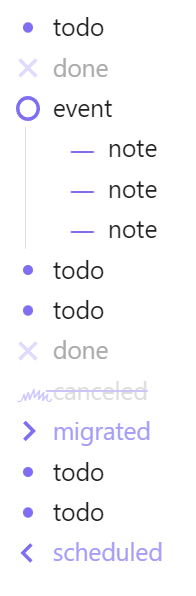

# The Bullet Journal Rapid Logging Plugin for Obsidian
I recently came across the [Bullet Journal Method](https://www.tinyrayofsunshine.com/blog/bullet-journal-guide/). Something that impressed me about this method was how simple the basic tenets of the "rapid logging" system were: just a few types of bullets, each one quick to handwrite and easy to read. All the non-actionable bullet items take up the space of a block letter, while the actionable ones (the bullets) are pretty easy to pick out. Instantly, I wanted to implement the format into my favorite note-taking app, [Obsidian](https://obsidian.md/). Although some of the same bullet formatting techniques already exist in a wonderful Obsidian theme called [Minimal](https://minimal.guide/home/) (I highly recommend you go check it out), I decided the formatting syntax needed to be _just so_; and so I decided to [make something from scratch](https://x.com/vincentdnl/status/1268573228626333703). 

If you like the bullet journal method, you are now able to get that "BuJo" look with just a few lines of CSS code from this repo. It has been tested on both the default and Minimal themes. 

As is common to such projects, much of the code in this repo was born from helpful resources on the internet. The primary two were [Hotkeys++](https://publish.obsidian.md/hub/02+-+Community+Expansions/02.05+All+Community+Expansions/Plugins/hotkeysplus-obsidian) and a [post in an Obsidian forum](https://forum.obsidian.md/t/custom-bullet-points/83764/2) by hPiper. Be sure to check them out!

I hope you enjoy this plugin!

# Getting Started
Clone this folder to your `.obsidian > plugins` directory, and enable it from Obsidian's `Options > Community Plugins` menu.
For more information on adding custom plugins, see [this guide](https://docs.obsidian.md/Plugins/Getting+started/Build+a+plugin).

The Rapid Logging syntax is the same as your typical checkboxes. That is, 

```
- [ ] todo
- [x] done
```
or
```
* [ ] todo
* [x] done
```

Rapid Logging just adds more task variations. Namely:

```
- [ ] todo
- [x] done
- [o] event
- [-] note
- [>] migrated
- [<] scheduled
- [~] canceled
```

In Obsidian, all the above tasks (except for "todo") will be represented with a completed checkmark. What this plugin does is enable custom formatting for each type, and allow the user to cycle through the plugin types in the order listed above (todo, done, event, note...) using a hotkey. By default, this hotkey is set to `Ctrl + Enter`, and the hotkey for toggling in reverse order is `Ctrl + Shift + Enter`. You can change this hotkey by searching "Rapid Logging" in `Options > Hotkeys`.

### Syntax Example
```
- [ ] todo
- [x] done
- [o] event
	- [-] note
	- [-] note
	- [-] note
- [ ] todo
- [ ] todo
- [x] done
- [~] canceled
- [>] migrated
- [ ] todo
- [ ] todo
- [<] scheduled
```
### Rendered Results


In reader mode, only the "todo" (`* [ ]`) and "done" (`* [x]`) checkboxes can be toggled by clicking, while the other symbols remain locked. 

I recommend adding links to the "migrated" (`* [>]`) and scheduled (`* [<]`) line items (this is why their default highlighting is the same color as unpopulated links in Obsidian--it also clues you in to the tasks that you'll have to do another time).

If you don't like the icons I have here, it shouldn't be too hard to change them yourself! Have fun--assuming, for some sick reason, that's the kind of thing you do for fun. And if it _is_... uh, wanna get lunch later? You like sushi?
